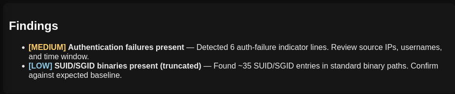
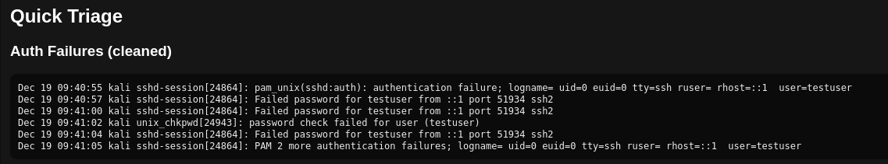

# Linux Incident Response & Forensics Automation Toolkit (IRAF)

IRAF is a **Python-based Linux Incident Response and Forensics toolkit** designed to automate post-incident triage, forensic evidence collection, and reporting on Linux systems.

The tool is built and tested on **Kali Linux** and supports **systemd journal-based logging**, making it suitable for modern Linux environments.

---

## 🔍 Key Features

- Automated forensic artifact collection
- SSH authentication failure detection (brute-force indicators)
- Native support for `journalctl` (systemd logs)
- Evidence integrity via SHA-256 hashing
- Threshold-based severity classification (LOW / MEDIUM / HIGH)
- Analyst-friendly HTML and JSON report generation
- Single-VM execution (no complex lab setup)

---

## 🛠 Tools & Technologies

- **Python 3**
- **Linux Internals** (PAM, SSH, processes, networking)
- **systemd journal (`journalctl`)**
- **Jinja2** (HTML reporting)
- **SHA-256 hashing** (evidence integrity)

---

## 📁 Evidence Collected

IRAF automatically collects and preserves the following artifacts:

### Authentication & User Activity
- SSH authentication failures
- Logged-in users and login history
- Failed login attempts

### Persistence & Privilege Indicators
- SUID/SGID binaries (baseline review)
- Cron jobs (system and user)
- Sudo configuration

### System & Process State
- Running processes and CPU usage
- Process tree
- Kernel modules

### Network Evidence
- Active connections
- Listening services
- IP configuration and routing

### Critical Files
- `/etc/passwd`
- `/etc/group`
- `/etc/shadow`
- `/etc/sudoers`
- `/etc/hosts`
- `/etc/resolv.conf`

---

## 🚨 Detection Logic

Authentication failures are classified using **threshold-based severity**:

| Failed Attempts | Severity |
|----------------|----------|
| 1–3            | LOW      |
| 4–9            | MEDIUM   |
| ≥10            | HIGH     |

This design reduces false positives and aligns with **real SOC and incident response alerting practices**.

---

## 📸 Screenshots

### Findings Summary
Demonstrates severity classification and baseline-aware findings.



---

### Authentication Failure Triage
Shows real SSH authentication failures extracted from the systemd journal.



---

## ▶️ How to Run

### 1. Setup Virtual Environment
```bash
python3 -m venv venv
source venv/bin/activate
pip install -r requirements.txt
```
### 2. Run IRAF
```bash
sudo -E venv/bin/python iraf.py --case-name ssh_demo --out ./cases
```
### 3. Open the report
```bash
xdg-open ./cases/ssh_demo_*/report.html
```
---

## 📌 Use Cases
- SOC Analyst training
- Incident Response simulations
- Linux forensic triage
- Security portfolio demonstration

---

## ⚠️ Notes
- Generated forensic evidence (cases/) is excluded from the repository.
- Tool is intended for educational and defensive security use only.
- Designed for single-system incident response, not live production monitoring.
